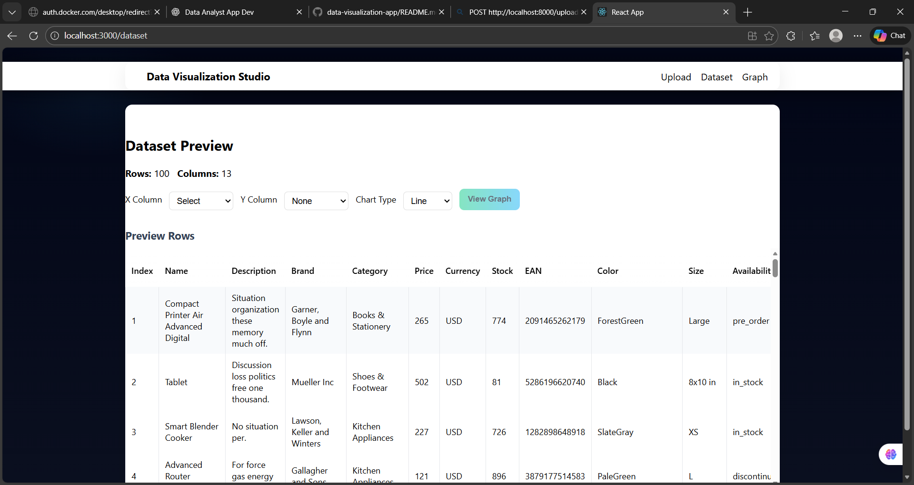
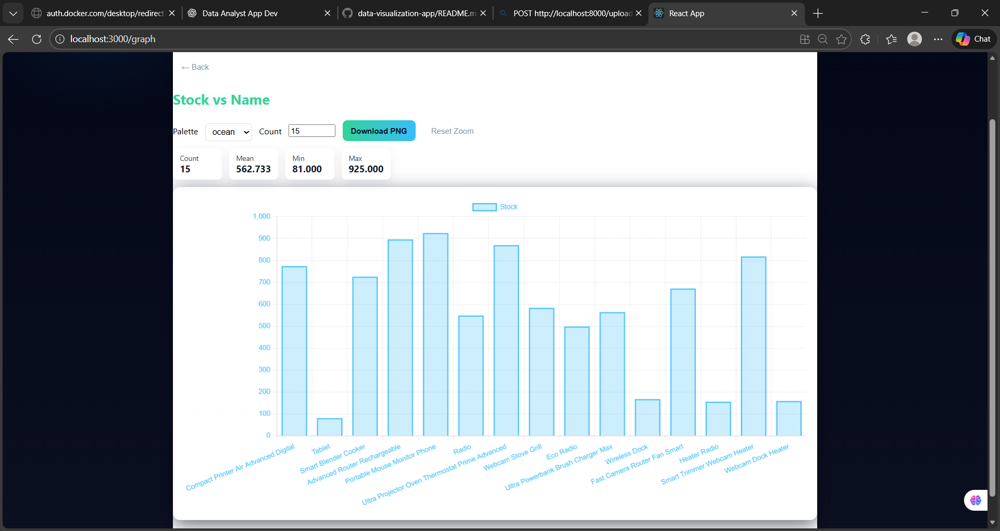
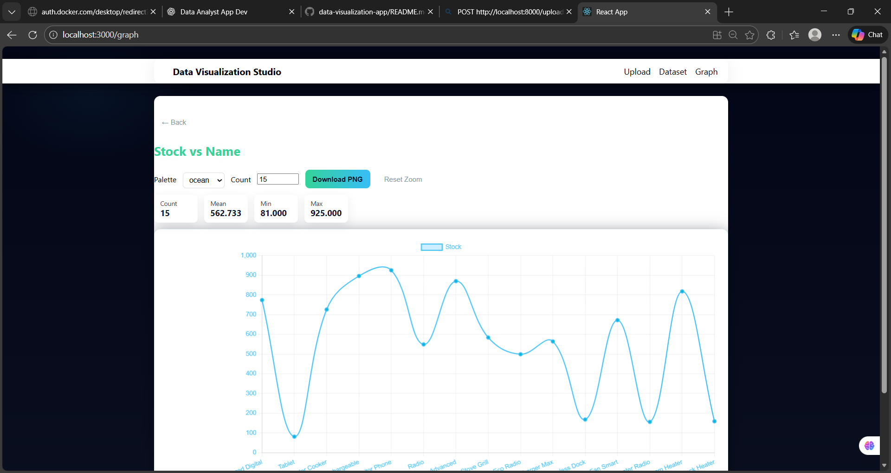
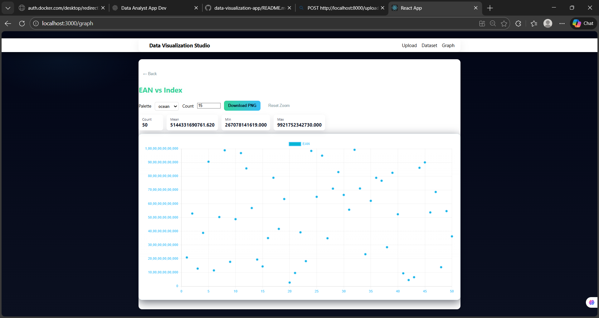

# Data Analyst & Visualization App
pip install fastapi uvicorn pandas python-multipart --timeout 100
## 📤 Upload Dataset

## 📊 Dataset Analysis

## 📈 Interactive Charts

## 📈 Interactive Charts

## 📈 Interactive Charts

## 📈 Interactive Charts

